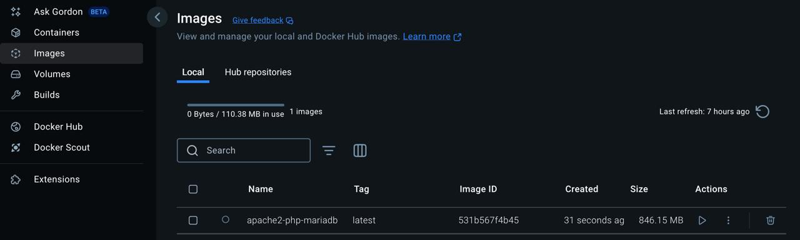
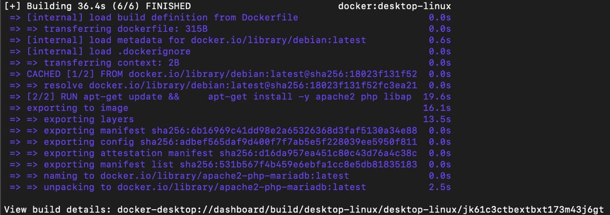
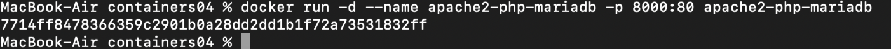
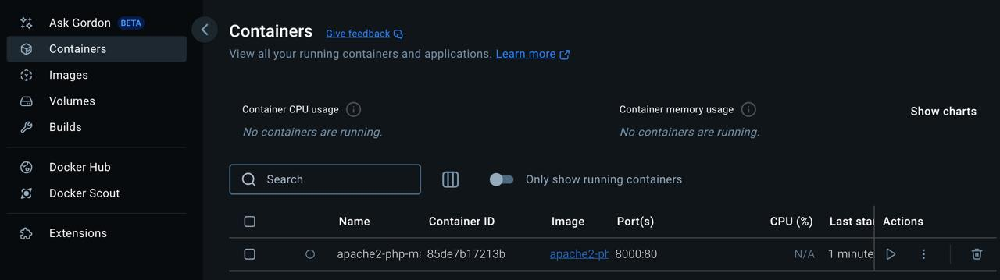
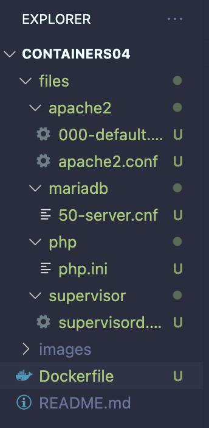
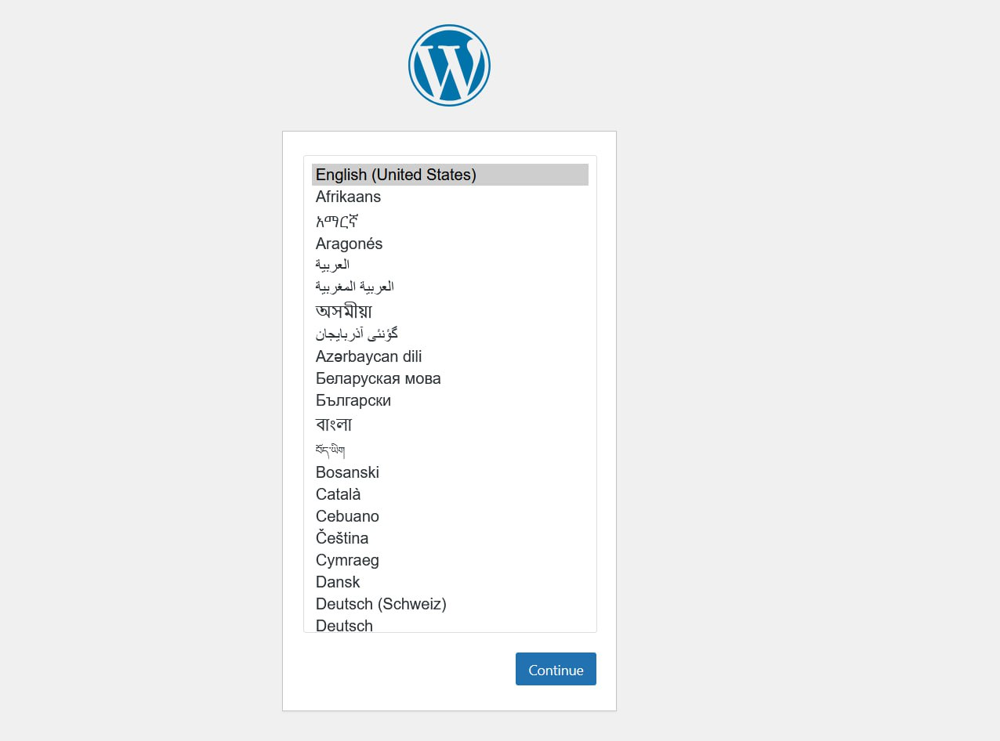

# Laborator: Configurarea unui container cu Apache, PHP și MariaDB

## Scopul lucrării
După executarea acestei lucrări, studentul va fi capabil să pregătească un container pentru a rula un site web bazat pe Apache HTTP Server + PHP (mod_php) + MariaDB.

## Sarcina
Creați un fișier Dockerfile pentru a construi o imagine a containerului care va conține un site web bazat pe Apache HTTP Server + PHP (mod_php) + MariaDB. Baza de date MariaDB trebuie să fie stocată într-un volum montat. Serverul trebuie să fie disponibil pe portul 8000. Instalați site-ul WordPress și verificați funcționarea acestuia.

## Descrierea execuției

1. Crearea depozitului și a structurii de directoare:
   mkdir -p containers04/files/{apache2,php,mariadb,supervisor}
   cd containers04

2. Scrierea Dockerfile-ului:
   - Se instalează Apache, PHP, MariaDB și Supervisor.
   - Se descarcă și instalează WordPress.
   - Se copiază fișierele de configurare și se configurează Supervisor pentru a porni Apache și MariaDB.
   
3. Construirea imaginii:
   docker build -t apache2-php-mariadb .

4. Pornirea containerului:
   docker run -d --name apache2-php-mariadb -p 8000:80 -v /var/lib/mysql -v /var/log apache2-php-mariadb

5. Copierea fișierelor de configurare:
   docker cp apache2-php-mariadb:/etc/apache2/sites-available/000-default.conf files/apache2/
   docker cp apache2-php-mariadb:/etc/apache2/apache2.conf files/apache2/
   docker cp apache2-php-mariadb:/etc/php/8.2/apache2/php.ini files/php/
   docker cp apache2-php-mariadb:/etc/mysql/mariadb.conf.d/50-server.cnf files/mariadb/

6. Modificarea fișierelor de configurare:
   - files/apache2/000-default.conf: setare ServerName localhost
   - files/php/php.ini: ajustare error_log, memory_limit, upload_max_filesize, post_max_size, max_execution_time
   - files/mariadb/50-server.cnf: activare log_error

7. Crearea bazei de date și a utilizatorului:
   docker exec -it apache2-php-mariadb mysql -e "CREATE DATABASE wordpress;"
   docker exec -it apache2-php-mariadb mysql -e "CREATE USER 'wordpress'@'localhost' IDENTIFIED BY 'wordpress';"
   docker exec -it apache2-php-mariadb mysql -e "GRANT ALL PRIVILEGES ON wordpress.* TO 'wordpress'@'localhost';"
   docker exec -it apache2-php-mariadb mysql -e "FLUSH PRIVILEGES;"

8. Configurarea WordPress:
   - Accesați http://localhost:8000/ și urmați instrucțiunile de instalare.
   - La final, copiați conținutul wp-config.php în files/wp-config.php.

9. Reconstruirea imaginii cu fișierul `wp-config.php`:
   docker build -t apache2-php-mariadb .

## Întrebări și răspunsuri

1. Ce fișiere de configurare au fost modificate?
   - 000-default.conf pentru Apache
   - apache2.conf pentru Apache
   - php.ini pentru PHP
   - 50-server.cnf pentru MariaDB
   - wp-config.php pentru WordPress

2. Pentru ce este responsabilă instrucția DirectoryIndex din fișierul de configurare Apache?
   - Aceasta definește fișierele implicite care vor fi servite când un director este accesat, prioritizând index.php și index.html.

3. De ce este necesar fișierul wp-config.php?
   - Acesta conține informațiile de conectare la baza de date și alte configurații esențiale pentru WordPress.

4. Pentru ce este responsabil parametrul post_max_size din fișierul de configurare PHP?
   - Determină dimensiunea maximă a datelor acceptate într-un request POST.

5. Care sunt deficiențele imaginii containerului creat?
   - Lipsa unui mecanism automat de inițializare a bazei de date WordPress.
   - Posibilă supraîncărcare a serverului din cauza setărilor implicite ale Apache și MariaDB.
   - Dependența de supervisord, care nu este metoda recomandată pentru rularea mai multor servicii într-un container.

   ## Concluzii

   În concluzie, am reușit să configurez un container Docker care include Apache, PHP, MariaDB și WordPress. Am urmat pașii pentru crearea structurii de directoare, scrierea Dockerfile-ului, construirea imaginii și pornirea containerului. După ce am configurat fișierele necesare și am setat baza de date, am testat funcționarea WordPress-ului. Cu toate acestea, am constatat câteva aspecte care ar putea fi îmbunătățite, cum ar fi lipsa unui mecanism automat de inițializare pentru WordPress și dependența de supervisord. 

   

   

   

   

   

   

